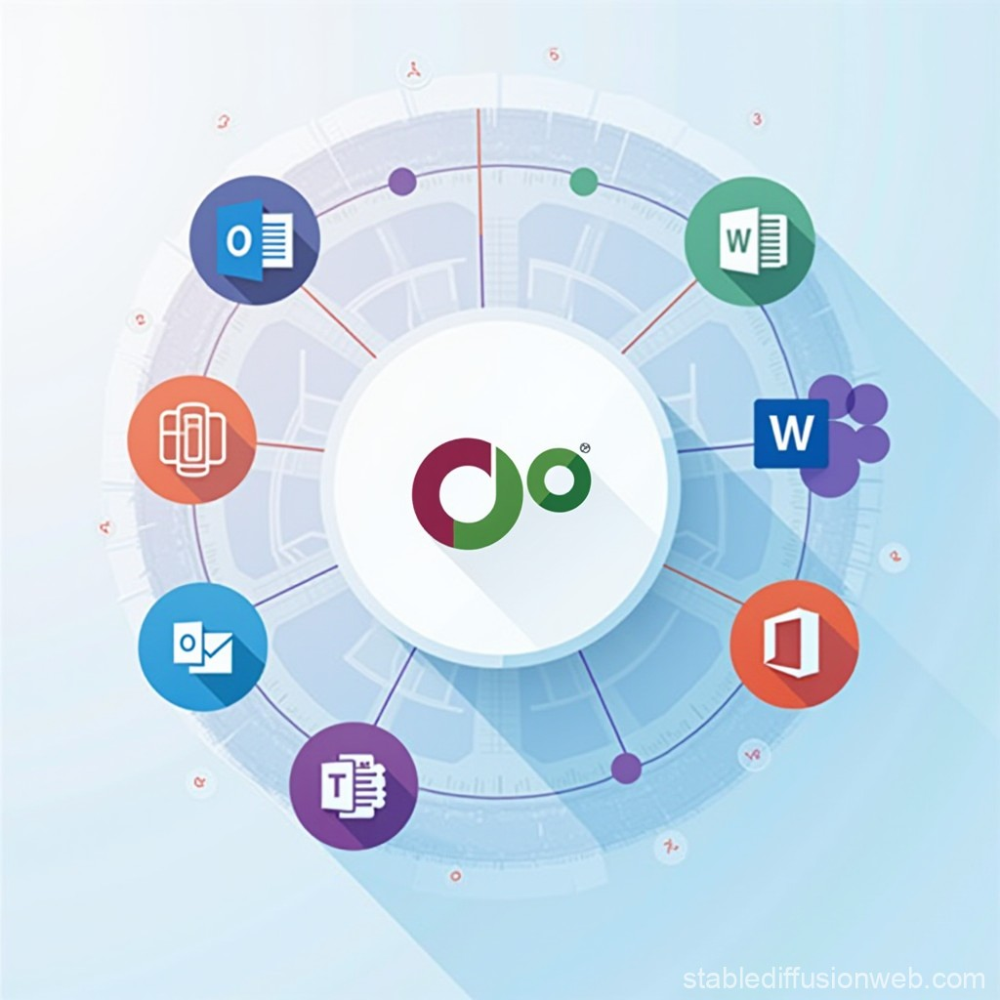

## Mục tiêu

Mục tiêu của hệ thống tài liệu là hỗ trợ nhân viên và các bên liên quan:

- **Hiểu rõ** các quy trình làm việc và cách sử dụng các công cụ một cách hiệu quả.
- **Tiếp cận** thông tin cần thiết để thực hiện các nhiệm vụ hàng ngày.
- **Giải quyết** các vấn đề phổ biến mà người dùng có thể gặp phải khi sử dụng hệ thống.

## Các Hệ thống và Công cụ

### Odoo
Odoo là một giải pháp ERP toàn diện, cung cấp các ứng dụng quản lý kinh doanh từ bán hàng, kế toán, kho hàng, sản xuất đến nhân sự. Tài liệu này sẽ cung cấp các hướng dẫn cụ thể về cách sử dụng từng mô-đun của Odoo để tối ưu hóa quy trình làm việc.

### Microsoft 365
Microsoft 365 bao gồm các công cụ cộng tác và quản lý tài liệu như OneDrive, Outlook, SharePoint, Teams và bộ Office 365 phiên bản web. Tài liệu sẽ hướng dẫn cách sử dụng từng công cụ một cách hiệu quả, từ quản lý email và lịch biểu, lưu trữ và chia sẻ tài liệu, đến cộng tác trong nhóm.

## Cách Sử dụng Tài liệu

- **Thanh công cụ tìm kiếm**: Sử dụng thanh công cụ tìm kiếm ở phía trên để nhanh chóng tìm thấy hướng dẫn bạn cần.
- **Menu điều hướng**: Các phần và chương của tài liệu được sắp xếp theo hệ thống để dễ dàng điều hướng.
- **Liên kết tham khảo**: Mỗi trang tài liệu có thể chứa các liên kết tham khảo đến các trang liên quan khác trong hệ thống tài liệu.

Hãy bắt đầu bằng cách chọn một hệ thống từ menu bên trái hoặc sử dụng thanh tìm kiếm để tìm kiếm thông tin cụ thể.

Nếu bạn gặp bất kỳ vấn đề nào trong quá trình sử dụng tài liệu này, vui lòng liên hệ với bộ phận hỗ trợ kỹ thuật để được trợ giúp.

Chúc bạn thành công!
